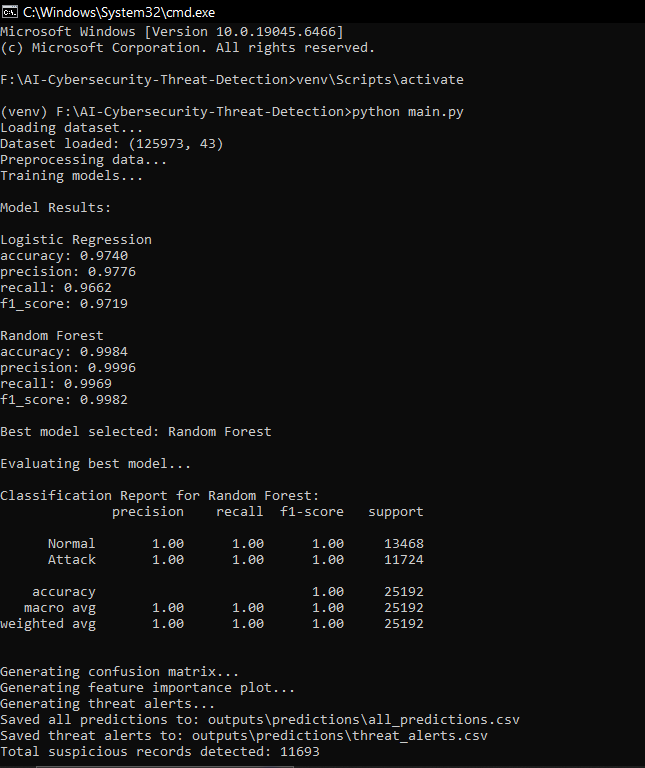
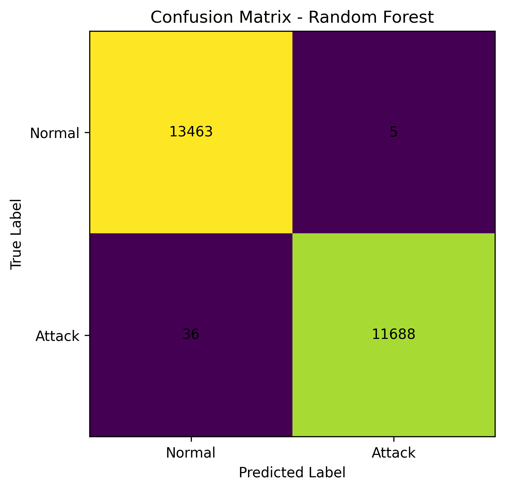
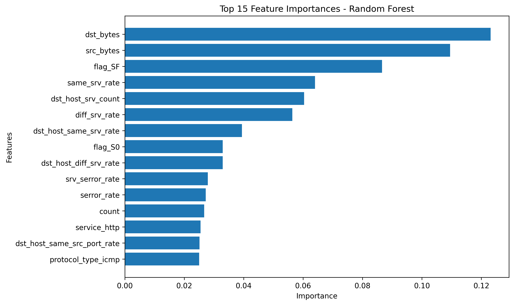
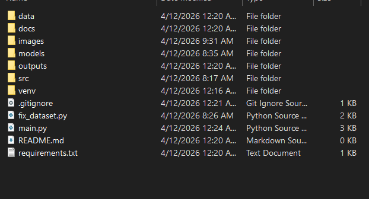

Paste this into your `README.md`.

````markdown
# AI-Powered Cybersecurity Threat Detection System

## Overview
This project is a beginner-friendly Machine Learning based cybersecurity system that detects suspicious or malicious network activity from structured network traffic data.

It uses the **NSL-KDD dataset** and trains ML models to classify traffic into:

- **Normal**
- **Attack**

The system performs:

- dataset loading
- preprocessing
- feature encoding and scaling
- model training
- evaluation
- threat prediction
- alert generation
- graph creation for project proof

This project is useful for students who want to build a realistic, industry-relevant cybersecurity project for:

- GitHub portfolio
- internships
- placements
- resume projects
- viva and interviews

---

## Problem Statement
Traditional cybersecurity systems often depend on fixed rules and signatures. These systems may fail to detect new attack patterns or suspicious behaviors.

This project solves that problem by using Machine Learning to learn patterns from network traffic and predict whether the activity is normal or malicious.

---

## Industry Relevance
AI-powered threat detection is used in real-world cybersecurity for:

- intrusion detection
- anomaly detection
- SOC alerting
- malware behavior monitoring
- suspicious network activity detection
- fraud and unauthorized access monitoring

Companies in banking, IT, cloud, and product-based sectors use similar concepts to improve security monitoring and reduce manual effort.

---

## Project Objectives
The objective of this project is to:

- build a practical cybersecurity ML pipeline
- detect attack traffic from structured network data
- compare multiple models
- generate threat alerts
- create graphs and proof assets for GitHub showcase

---

## Tech Stack
- **Python**
- **Pandas**
- **NumPy**
- **Scikit-learn**
- **Matplotlib**
- **Joblib**

---

## Dataset
This project uses the **NSL-KDD dataset**.

The dataset contains network traffic records with multiple features such as:

- protocol type
- service
- source bytes
- destination bytes
- error rate
- connection count
- and attack label

### Dataset classes used in this project
- **Normal**
- **Attack**

For this project, all attack categories are converted into one group called **Attack**, and normal traffic is treated as **Normal**.

---

## Folder Structure

```text
AI-Cybersecurity-Threat-Detection/
│
├── data/
│   ├── raw/
│   │   └── nsl_kdd.csv
│   └── processed/
│
├── models/
│   ├── random_forest_model.pkl
│   └── preprocessor.pkl
│
├── outputs/
│   ├── graphs/
│   │   ├── random_forest_confusion_matrix.png
│   │   └── random_forest_feature_importance.png
│   ├── predictions/
│   │   ├── all_predictions.csv
│   │   └── threat_alerts.csv
│   └── reports/
│
├── src/
│   ├── data_loader.py
│   ├── preprocess.py
│   ├── train_model.py
│   ├── evaluate.py
│   ├── detect_threat.py
│   └── utils.py
│
├── images/
│   ├── terminal_output.png
│   ├── confusion_matrix.png
│   ├── feature_importance.png
│   └── folder_structure.png
│
├── docs/
├── main.py
├── requirements.txt
├── .gitignore
└── README.md
````

---

## Project Workflow

The complete workflow of this project is:

1. Load dataset
2. Identify target column
3. Clean and preprocess data
4. Encode categorical features
5. Scale numeric features
6. Split into train and test data
7. Train ML models
8. Evaluate model performance
9. Select best model
10. Generate confusion matrix
11. Generate feature importance graph
12. Save predictions and threat alerts

---

## Models Used

### 1. Logistic Regression

Used as a baseline model for comparison.

### 2. Random Forest

Used as the main model for classification.

### 3. Isolation Forest

Included as an optional anomaly detection concept for future improvement.

---

## Results

The project was trained and tested successfully.

### Model Performance

#### Logistic Regression

* **Accuracy:** 97.40%
* **Precision:** 97.76%
* **Recall:** 96.62%
* **F1 Score:** 97.19%

#### Random Forest

* **Accuracy:** 99.84%
* **Precision:** 99.96%
* **Recall:** 99.69%
* **F1 Score:** 99.82%

### Best Model

**Random Forest** was selected as the best model.

### Threat Detection Summary

* **Total suspicious records detected:** 11,693

---

## Output Files Generated

### In `outputs/graphs/`

* confusion matrix image
* feature importance graph

### In `outputs/predictions/`

* full predictions CSV
* threat alerts CSV

### In `models/`

* trained model file
* preprocessing pipeline file

---

## Images / Screenshots Section


markdown
## Project Screenshots

### Terminal Output


### Confusion Matrix


### Feature Importance Graph


### Folder Structure


---

## Beginner-Friendly Tutorial

# Step 1: Install Python

Install Python 3.10 or above.

While installing Python:

* check **Add Python to PATH**

To verify installation, open Command Prompt and run:

```bash
python --version
```

---

# Step 2: Open Project Folder in VS Code

Open VS Code.

Then open your project folder:

```text
F:\AI-Cybersecurity-Threat-Detection
```

You can use:

* **File > Open Folder**
* choose `F:\AI-Cybersecurity-Threat-Detection`

---

# Step 3: Open Terminal in VS Code

In VS Code:

* click **Terminal**
* click **New Terminal**

Shortcut:

```text
Ctrl + `
```

---

# Step 4: Create Virtual Environment

In terminal, run:

```bash
python -m venv venv
```

This creates a virtual environment folder named `venv`.

---

# Step 5: Activate Virtual Environment

## On Windows CMD

```bash
venv\Scripts\activate
```

After activation, terminal will look like:

```text
(venv) F:\AI-Cybersecurity-Threat-Detection>
```

---

# Step 6: Install Required Libraries

Run:

```bash
pip install pandas numpy scikit-learn matplotlib joblib flask
```

---

# Step 7: Save Requirements File

Run:

```bash
pip freeze > requirements.txt
```

---

# Step 8: Prepare Dataset

Place the dataset file here:

```text
data/raw/nsl_kdd.csv
```

Make sure:

* file name is `nsl_kdd.csv`
* it has correct headers
* it contains the `label` column
* optional extra column: `difficulty_level`

---

# Step 9: Run the Project

Run:

```bash
python main.py
```

---

# Step 10: Expected Output

After successful execution, you should see:

* dataset loaded message
* training started
* model results
* best model selected
* classification report
* confusion matrix generated
* feature importance graph generated
* threat alerts saved

---

# Step 11: Check Generated Files

After running, check these folders:

## Graphs

```text
outputs/graphs/
```

You should see:

* `random_forest_confusion_matrix.png`
* `random_forest_feature_importance.png`

## Predictions

```text
outputs/predictions/
```

You should see:

* `all_predictions.csv`
* `threat_alerts.csv`

## Models

```text
models/
```

You should see:

* saved model file
* `preprocessor.pkl`

---

## How to Run This Project Again Later

Whenever you reopen the project, do this:

### Step 1

Open terminal in project folder

### Step 2

Activate venv

```bash
venv\Scripts\activate
```

### Step 3

Run project

```bash
python main.py
```

---

## Beginner Tips

* Always activate `venv` before running project
* Keep dataset inside `data/raw/`
* Do not rename Python files randomly
* If graphs do not open, check `outputs/graphs/`
* If you get import error, install libraries again
* If VS Code uses wrong Python, select interpreter manually

---

## How to Select Correct Python Interpreter in VS Code

If VS Code uses wrong Python:

1. Press `Ctrl + Shift + P`
2. Search: `Python: Select Interpreter`
3. Choose:

```text
F:\AI-Cybersecurity-Threat-Detection\venv\Scripts\python.exe
```

---

## Sample Commands

### Create venv

```bash
python -m venv venv
```

### Activate venv

```bash
venv\Scripts\activate
```

### Install libraries

```bash
pip install pandas numpy scikit-learn matplotlib joblib flask
```

### Run project

```bash
python main.py
```

---

# Explanation

This project analyzes structured network traffic data and classifies each record as normal or attack using Machine Learning. It applies preprocessing, feature engineering, classification, evaluation, and alert generation, similar to a simplified intrusion detection workflow.

---

## Learning Outcomes

From this project, I learned:

* cybersecurity dataset handling
* machine learning preprocessing
* categorical encoding
* feature scaling
* classification model training
* evaluation using accuracy, precision, recall, and F1-score
* graph generation
* alert generation
* GitHub project presentation

---

## Future Improvements

This project can be extended by adding:

* real-time packet capture
* Flask API deployment
* dashboard visualization
* multi-class attack classification
* live network monitoring
* SIEM integration
* anomaly-based real-time alert system

---

## Author

Atharv Bunde
Mechatronics Engineering Student

University: Dr. Babasaheb Ambedkar Technological University (DBATU)

Specialization: Industrial Automation | AIoT | Robotics

Connect:linkdin : https://www.linkedin.com/public-profile/settings?lipi=urn%3Ali%3Apage%3Ad_flagship3_profile_self_edit_contact-info%3BhK4%2Fz9mAQl2sk2f2T%2Fp7Pg%3D%3D
---

## LicenseLicense
This project is licensed under the MIT License - see the LICENSE file for details.

````
